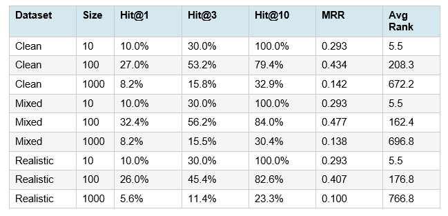

# Semantic Search System (Gemini + Pinecone)

Ovaj projekat implementira sistem za semantičku pretragu industrijskih entiteta koristeći Google Gemini za embeddinge i Pinecone kao vektorsku bazu podataka.

## Struktura projekta

- `src/` - Srž sistema (logika za embedding, bazu, procesiranje i evaluaciju).
- `scripts/` - Skripte za pokretanje (upsert podataka, evaluacija, generisanje query-a...).
- `data/` - Ulazni podaci i testni upiti.
- `datasets/` - Generisani sintetički podaci (clean, mixed, realistic profili).
- `results/` - Rezultati evaluacije u CSV formatu (Hit@K, MRR).
- `.env` - Konfiguracioni fajl za API ključeve.

## Kako pokrenuti

1. **Instalacija zavisnosti:**
```bash
   pip install-r requirements.txt
```

2. **Podešavanje okruženja:**
   Kreirati `.env` fajl u root-u i dodati:
```env
   PINECONE_API_KEY=key
   GEMINI_API_KEY=key
   PINECONE_INDEX_NAME=indeks
```

3. **Pokretanje upserta i evaluacije:**
   Pre pokretanja podesiti fajlove koji se učitavaju u skriptama, podešavanje se radi na dnu ove dve skripte:
```powershell
   python scripts/upsert_to_pinecone.py
   python scripts/evaluate_retrieval.py
```

## Dijagrami

https://app.eraser.io/workspace/TXfnAgvQnjOJGXvuS5Lq?origin=share

## Metodologija i Evaluacija

Sistem meri preciznost pretrage kroz sledeće metrike:
- **Hit@1, Hit@5, Hit@10**: Procenat upita gde se tačan rezultat nalazi u prvih N rezultata.
- **MRR (Mean Reciprocal Rank)**: Prosečan rang tačnog rezultata.

Svi izveštaji se automatski generišu u folderu `results/`.

---

## Rezultati evaluacije

Detaljnom evaluacijom na tri tipa dataseta (clean, mixed, realistic) i tri veličine (10, 100, 1000 primera) identifikovani su sledeći obrasci:

**Profili:**
"realistic": {"empty": 0.40, "minimal": 0.30, "medium": 0.20, "detailed": 0.10},
"clean": {"empty": 0.05, "minimal": 0.20, "medium": 0.40, "detailed": 0.35},
"mixed": {"empty": 0.20, "minimal": 0.25, "medium": 0.35, "detailed": 0.20}

Detaljnije objasnjeno u okviru promta u generate_test_queries.py

### Performanse po veličini dataseta



| Veličina | Hit@1 (Clean) | Hit@1 (Mixed) | Hit@1 (Realistic) | Prosečan MRR |
|----------|---------------|---------------|-------------------|--------------|
| **10**   | 10.0%         | 10.0%         | 10.0%             | 0.293        |
| **100**  | 27.0%         | **32.4%**     | 26.0%             | 0.434        |
| **1000** | 8.2%          | 8.2%          | **5.6%**          | 0.138        |

### Ključni nalazi

**Optimalna veličina: ~100 primera**
- Sistem postiže najbolje rezultate na ovoj skali
- Mixed dataset daje najbolje performanse (32.4% Hit@1)

**Problem skalabilnosti na 1000+ primera**
- Performanse padaju za 70-80% u odnosu na 100 primera
- Medijan ranga skače sa 3 na 999 (maksimalno moguć rang)
- 67-77% upita rangira tačan rezultat na **poslednje mesto**
- Sistem je često >80% siguran u pogrešan rezultat

**Performanse po tipu upita (1000 primera)**
- Exact/Fuzzy Match: 13-15% Hit@1 (najlakši upiti)
- Type Search: 1-2% Hit@1
- Location Search: 0.2-0.5% Hit@1  
- Semantic Search: 0.5-0.8% Hit@1

### Statistička značajnost
- Pad performansi 100→1000 je visoko statistički značajan (p < 10⁻⁹⁰)
- Obrazac je konzistentan preko svih tipova dataseta
- Korelacija correct_score sa rangom: r ≈ -0.99

---

## Moguća rešenja za poboljšanje

Identifikovano je nekoliko pravaca za potencijalno poboljšanje sistema:

### 1. Hibridna pretraga (BM25 + Embeddings)
Kombinovati keyword-based pretragu (BM25) sa vektorskom pretragom:
- BM25 za inicijalno filtriranje kandidata
- Embeddings za re-ranking rezultata
- Dokazano efikasno u sličnim sistemima

### 2. Alternativni embedding modeli
Testirati naprednije modele koji mogu bolje razumeti domenske termine.

### 3. Hijerarhijsko indeksiranje
Particionisati prostor pretrage po kategorijama/lokacijama:
- Smanjuje gustinu embedding prostora
- Omogućava specijalizovano tuniranje
- Brža pretraga na manjim podskupovima

### 4. Metadata augmentation
Dodati strukturirane metapodatke pre embedding-a:
- Primer: `[TIP: Mixer] [LOKACIJA: Zgrada A] Mixer 3`
- Eksplicitni kontekstualni signali
- Relativno brza implementacija

## Zaključak
Iako su performanse prihvatljive na 100 primera, sistem se fundamentalno raspada na 1000 primera, pri čemu se tačni odgovori konstantno rangiraju skoro na poslednjem mestu uprkos velikoj sigurnosti u netačne rezultate.
Preporučeni hibridni pristup pretraživanju može se brzo implementirati i trebalo bi da pruži trenutno olakšanje.